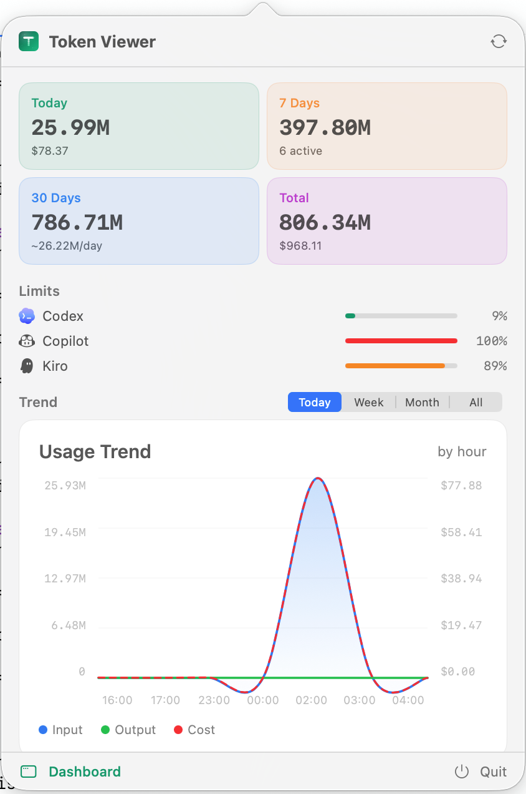

<div align="center">

# TokenViewer

[English](./README.md) · **简体中文**

### 在菜单栏追踪你的 AI Token 用量 — 支持 22 个工具

一款原生 macOS 菜单栏应用，静默收集你使用的每个 AI 编程工具的 Token 数量和费用，并在精美的仪表盘中为你呈现完整图景。无需云端、无需账号、无需 Node.js，只是一个小巧的原生应用。

[](https://creativecommons.org/licenses/by-nc/4.0/)
[](https://github.com/webkong/TokenViewer/releases/latest)
[](https://github.com/webkong/TokenViewer/stargazers)

<br/>



</div>

---

## ✨ 功能特性

- 📊 **仪表盘** — 今天 / 7 天 / 30 天 / 总计 Token 数量和费用
- 💰 **费用追踪** — 按模型定价，支持多币种显示
- 📈 **使用趋势** — 平滑日 / 小时图表，含缓存命中率
- 🗓️ **活跃度热力图** — 53 周 GitHub 风格日历网格
- 🔒 **限额监控** — Codex、Copilot、Kiro、Cursor、Gemini、Kimi 实时配额进度条
- 🌍 **中文 / 英文界面**
- 🏠 **100% 本地** — 所有数据存储在 `~/.tokenviewer/data.db`（SQLite）。无云端，无账号。

## ⚡ 快速开始

1. [下载最新 DMG](https://github.com/webkong/TokenViewer/releases/latest)
2. 打开 DMG，将 **TokenViewer.app** 拖入 `/Applications`
3. 启动 — 菜单栏出现 T 图标
4. 点击图标查看用量摘要
5. 数据在后台自动同步

## 🛠️ 支持的工具（22 个）

| 工具 | 数据来源 |
|------|---------|
| Claude Code | `~/.claude/projects/*.jsonl` |
| Codex | `~/.codex/sessions/**/rollout-*.jsonl` |
| Kiro CLI | `~/.kiro/sessions/cli/*.json` |
| Kiro IDE | `~/Library/.../kiro.kiroagent/dev_data/` |
| GitHub Copilot | `~/.copilot/otel/*.jsonl` |
| Cursor | `cursorDiskModel/usage.json` |
| Gemini CLI | `~/.gemini/tmp/*/chats/*.json` |
| Opencode | `~/.local/share/opencode/opencode.db` |
| Roocode | VSCode globalStorage `ui_messages.json` |
| Kilo Code | VSCode globalStorage |
| Zed | `~/Library/.../threads.db` |
| Goose | `~/Library/.../sessions.db` |
| Grok | `~/.grok/sessions/**/updates.jsonl` |
| Kimi | `~/.kimi/sessions/**/*.jsonl` |
| Craft | `~/.craft-agent/**/*.jsonl` |
| OpenClaw | `~/.openclaw/agents/**/*.jsonl` |
| Hermes | `~/.hermes/state.db` |
| Antigravity | `~/.gemini/antigravity*/` |
| CodeBuddy | `~/.codebuddy/**/*.jsonl` |
| OhMyPi | `~/.omp/agent/sessions/**/*.jsonl` |
| Pi | `~/.pi/agent/sessions/**/*.jsonl` |
| KiloCLI | `~/.local/share/kilo/kilo.db` |

## 🏗️ 从源码构建

**环境要求：** macOS 14+、Xcode 16+、Rust（aarch64-apple-darwin）、XcodeGen

```bash
git clone https://github.com/webkong/TokenViewer.git
cd TokenViewer/TokenViewerNew

# 一键构建并运行
./run.sh
```

或分步执行：
```bash
# 1. 构建 Rust 核心
cd core && cargo build --release --target aarch64-apple-darwin

# 2. 生成 Xcode 项目
cd ../macos && xcodegen generate

# 3. 构建 App
xcodebuild -scheme TokenViewer -configuration Release build
```

## 🌐 官网

[tokenviewer.webkong.top](https://tokenviewer.webkong.top)

## 📜 开源协议

[CC BY-NC 4.0](LICENSE) — 允许个人和非商业用途免费使用。
再分发或修改时须注明出处。
不允许商业用途。

## 🙏 致谢

由 [webkong](https://github.com/webkong) 构建。
灵感来自 [TokenTracker](https://github.com/mm7894215/TokenTracker)。
